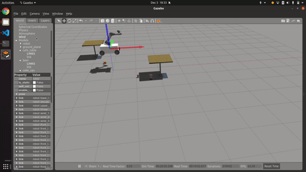
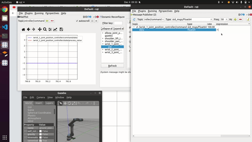
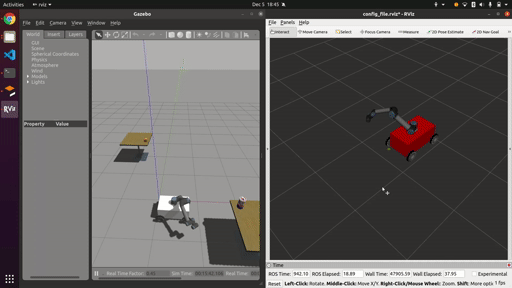

# Enpm662 Final Project

Mecanum Wheel [FM202-205-15U-R/L (FUJI)](http://www.fuji-bearing.com/japanese/products/conveyor/conveyor0408.html)
gazebo model description.

## Documents:
1. Link to report, discussions are [here](https://drive.google.com/drive/folders/1Rp32GsWSPNQBrzzu0iJeZsF_Ti1MLDRo?usp=sharing)
2. Jacobian calculation was done in MATLAB file which can be found [here](assets/).
## Setup


 - If running ROS Noetic, you might have to run this command in the terminals you open:
    ```
    mkdir ~/bin
    PATH=~/bin:$PATH
    ln -s /usr/bin/python3 ~/bin/python
    ```
    Subsequently, you can add `PATH=~/bin:$PATH` to `~/.bashrc`

## Test

- Gazebo simulation

  


- Run Vegetation pest survey node:
  ``` bash
  # Vegetation word Gazebo launch
  roslaunch enpm662_final_project gazebo_test_robot.launch
  ```

- Run sample world file:
  ```bash
  # Objects world Gazebo launch
  roslaunch enpm662_final_project gazebo_test_robot.launch argworld:=objects
  ```
  - Touch objects in environment using these commands:
    ```bash
    # Run Go to Goals node
    rosrun enpm662_final_project go_to_goals.py
    ```

- For Teleop run these 2 nodes:
  ```bash
  # Mecanum control node listener node
  rosrun enpm662_final_project test_mecanum_robot.py
  ```

  ```bash
  # Teleop control node
  rosrun enpm662_final_project test_publisher.py
  ```

## Data visualization:
Plot joint angles with RQT:


```
roslaunch enpm662_final_project rqt_vis.launch  
```

Visualize in Rviz:


```
# Rviz visualization:
roslaunch enpm662_final_project rviz.launch
```

## World file Models:
1. The bush model is taken from this [repository](https://github.com/kubja/gazebo-vegetation).
2. The world file is take from Agribot [repository](https://github.com/PRBonn/agribot).